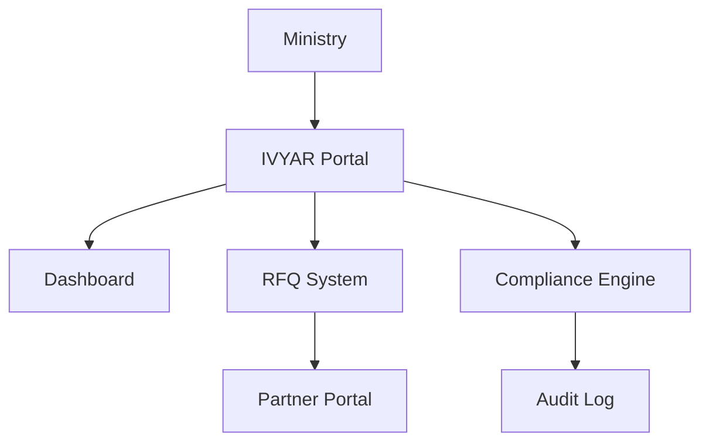
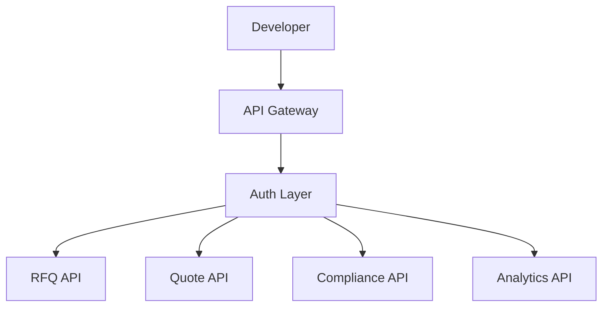
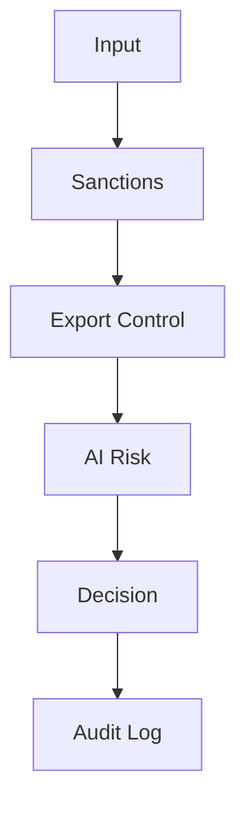

# IVYAR ARCHITECTURE DIAGRAMS (Mermaid)

## 1. Launch Architecture

```mermaid
flowchart TD
    A[Ministry] --> B[IVYAR Portal]
    B --> C[Dashboard]
    B --> D[RFQ System]
    B --> E[Compliance Engine]
    D --> F[Partner Portal]
    E --> G[Audit Log]
```

## 2. Partner Onboarding Flow

```mermaid
flowchart LR
    A[Register] --> B[MFA]
    B --> C[Upload Docs]
    C --> D[Verification]
    D --> E[Portal Access]
    E --> F[API Testing]
```

## 3. API Marketplace

```mermaid
flowchart TD
    A[Developer] --> B[API Gateway]
    B --> C[Auth Layer]
    C --> D[RFQ API]
    C --> E[Quote API]
    C --> F[Compliance API]
    C --> G[Analytics API]
```

## 4. Compliance Engine

```mermaid
flowchart TD
    A[Input] --> B[Sanctions]
    B --> C[Export Control]
    C --> D[AI Risk]
    D --> E[Decision]
    E --> F[Audit Log]
```

---
IVYAR LLC
