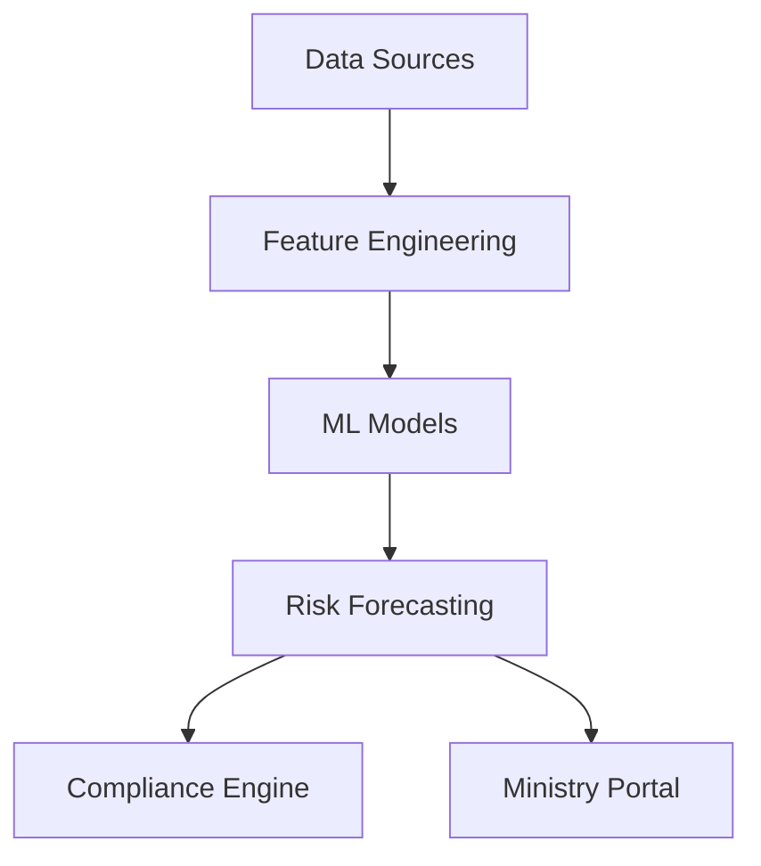
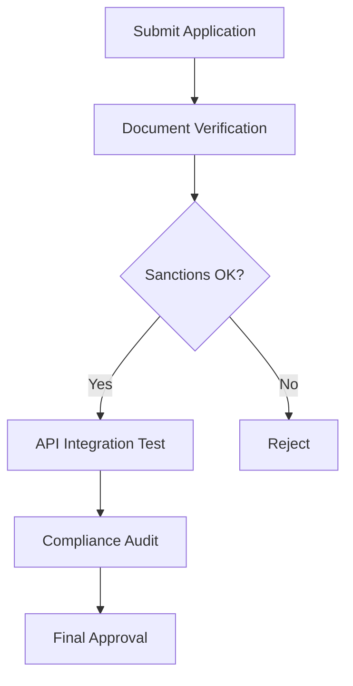

# IVYAR 2.0 MERMAID DIAGRAMS

## 1. Predictive Analytics Architecture


## 2. Partner Certification Flow


## 3. Government Pilot Timeline
```mermaid
gantt
    title Government Pilot Program
    section Phase 1
    Preparation: 14d
    section Phase 2
    Integration: 21d
    section Phase 3
    Testing: 28d
    section Phase 4
    Audit: 14d
```

---
IVYAR LLC
